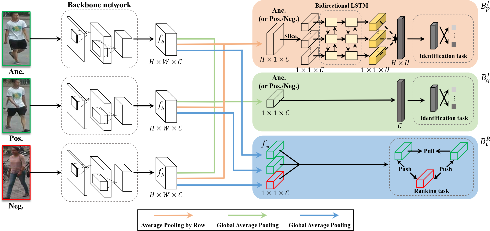

# Deep-Person: Learning Discriminative Deep Features for Person Re-Identification

Code for [Deep-Person: Learning Discriminative Deep Features for Person Re-Identification](https://arxiv.org/abs/1711.10658) based on [open-reid](https://github.com/Cysu/open-reid).


## Prerequisites
Deep-Person is developed and tested with Pytorch 0.2 and Python 3.6.

[Anaconda](https://www.anaconda.com/download/) is required to finish the Installation.
## Installation

```
cd DeepPerson/
conda env create -f environment.yml
```

This will create an environment named "deepperson". (use `conda list` to see all environments)

## Datasets Preparation
[Market1501](http://www.liangzheng.org/Project/project_reid.html)

[DukeMTMC-Reid](https://github.com/layumi/DukeMTMC-reID_evaluation)

[CUHK03](https://docs.google.com/spreadsheet/viewform?usp=drive_web&formkey=dHRkMkFVSUFvbTJIRkRDLWRwZWpONnc6MA#gid=0)


## Training and evaluation
**NOTE: You must activate "deepperson" environment first before running the code.**

To activate "deepperson" environment:

```
conda activate deepperson
```
To train a model:

```
cd DeepPerson/
python examples/deep.py -d market1501 --logs-dir logs/market
```

To evaluate a pretrained model:

```
cd DeepPerson/
python examples/deep.py -d market1501 --resume logs/market/checkpoint.pth.tar --evaluate
```

We provide a pretrained model on Market1501 which can be found at our [release page](https://github.com/zydou/Deep-Person/releases).
## Citation

If you find this project helpful for your research, please cite the following paper:

```
@article{xbai2017deepperson,
  author = {Xiang Bai and
               Mingkun Yang and
               Tengteng Huang and
               Zhiyong Dou and
               Rui Yu and
               Yongchao Xu},
  title   = {Deep-Person: Learning Discriminative Deep Features for Person Re-Identification},
  journal = {arXiv preprint arXiv:1711.10658},
  year    = {2017},
}
```

IMPORTANT NOTICE: Although this software is licensed under MIT, our intention is to make it free for academic research purposes. If you are going to use it in a product, we suggest you [contact us](xbai@hust.edu.cn) regarding possible patent issues.
